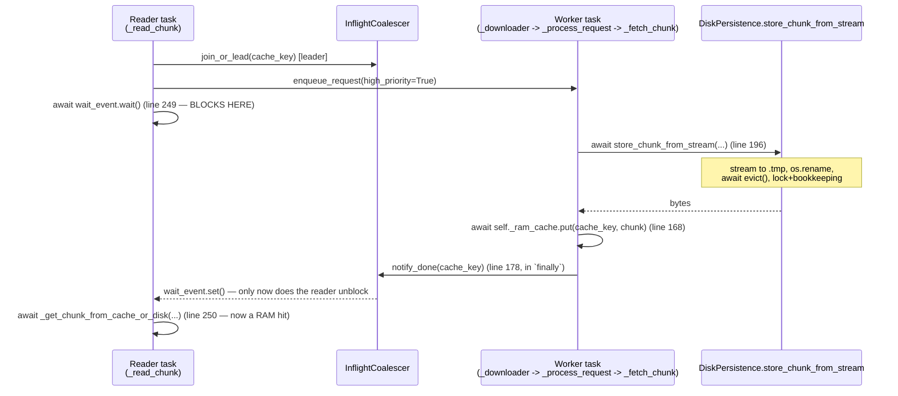

# P01 Deep-Dive — Async Disk-Cache Write

Detailed review of tracker item P01 ([.github/prompts/fuse4dbx-performance-engineer.md](../../.github/prompts/fuse4dbx-performance-engineer.md)). No code was modified. Scope: [fuse4dbricks/fs/data_manager.py](../../fuse4dbricks/fs/data_manager.py) and [fuse4dbricks/storage/persistence.py](../../fuse4dbricks/storage/persistence.py). This builds on the P01 section of [docs/performance/optimization-review.md](optimization-review.md) with exact call-chain tracing and line references.

---

## 1. Does disk persistence block readers?

**Yes — confirmed by tracing the exact task/coroutine chain from a cache-miss `read()` to the point its caller is unblocked.**

Two different `trio` tasks are involved, synchronized through `InflightCoalescer`:

- **Reader task** (the one serving the kernel's `read()` request): `DataManager.read()` → `DataManager._read_chunk()` ([fs/data_manager.py](../../fuse4dbricks/fs/data_manager.py) lines 228–251).
- **Worker task** (a `DownloadScheduler` pool worker, started in `run_services`): `DownloadScheduler._downloader()` → `DataManager._process_request()` (line 159) → `DataManager._fetch_chunk()` (line 185) → `DiskPersistence.store_chunk_from_stream()` ([storage/persistence.py](../../fuse4dbricks/storage/persistence.py) line 154).



The reader's unblocking point is `DataManager._process_request`'s `finally: await self._inflight_coalescer.notify_done(cache_key)` (line 178). Because this `finally` sits **outside** the `try` block that contains the entire `store_chunk_from_stream` call (lines 160–169), `notify_done` cannot fire — and therefore the reader cannot wake up — until `store_chunk_from_stream` has fully returned, including its internal `os.rename`, `evict()`, and lock-protected bookkeeping. This holds for **both** the leader and every coalesced follower: all of them are blocked on the same `wait_event`, which is gated by the same worker-task completion.

**Important correction to a looser framing:** it is not quite accurate to say "the disk *write* blocks the reader" as a single monolithic cost — the streaming write itself (`async for chunk in stream: await f.write(chunk)`, persistence.py lines 174–177) is interleaved with building the in-memory `result` bytearray from the *same* stream, so by the time the stream drains, the in-memory bytes and the on-disk `.tmp` file are substantively complete at roughly the same wall-clock time (modulo trio's thread-pool scheduling for each `f.write` call). The precise, avoidable extra latency is what happens **after** the stream has already fully drained and the bytes are already fully known in memory (`result`), specifically:

1. `os.rename(temp_path, cache_path)` (line 182) — one `to_thread` metadata syscall, fast.
2. `await self.evict(bytes_written)` (line 183) — **unbounded cost**: a `while True` loop (lines 198–224) that can pop-and-delete an arbitrary number of LRU entries (each its own `to_thread.run_sync(os.remove, ...)` round-trip) if the cache is near `max_size_bytes`. This is the main, variable-cost culprit.
3. `async with self.lock: current_size += ...; access_map[...] = now; heappush(...)` (lines 186–191) — fast, in-memory, but requires acquiring `self.lock`, which could be briefly contended by a concurrent `evict()`/`retrieve_chunk()`/`chunk_exists()` call from another task.

So: **yes, disk persistence blocks readers**, and the dominant, worst-case-unbounded component of that block is specifically `evict()`, not the streaming write itself.

---

## 2. Where cache writes happen

All disk-cache writes for the read path funnel through exactly one method:

| Call site | File:Line | Context |
|---|---|---|
| `DiskPersistence.store_chunk_from_stream` (definition) | [storage/persistence.py:154](../../fuse4dbricks/storage/persistence.py) | The only method that writes chunk bytes to disk (`.tmp` write + atomic rename) in the entire read path. |
| `DataManager._fetch_chunk` → `await self.persistence.store_chunk_from_stream(...)` | [fs/data_manager.py:196](../../fuse4dbricks/fs/data_manager.py) | Invoked for **every** cache-miss chunk fetch, regardless of priority. |
| `DataManager._process_request`, "high" priority branch | [fs/data_manager.py:159–169](../../fuse4dbricks/fs/data_manager.py) | On-demand read: `retrieve_chunk` (disk check) → on miss, `_fetch_chunk` (network + **disk write**) → `_ram_cache.put`. |
| `DataManager._process_request`, "regular" priority branch | [fs/data_manager.py:170–177](../../fuse4dbricks/fs/data_manager.py) | Prefetch: `chunk_exists` (disk check, no read) → on miss, `_fetch_chunk` (network + **disk write**), RAM cache deliberately *not* populated. |

There is exactly **one write path into the chunk cache** — both on-demand (high-priority) and prefetch (regular-priority) requests converge on `_fetch_chunk` → `store_chunk_from_stream`. There is no separate "background write" code path today; everything is synchronous-in-the-worker-task as described in §1.

(Out of scope for this file pair, but worth noting for completeness: the *other* on-disk write in the system, `fs/write_buffer.py`'s `WriteBuffer`, is unrelated to the read-side disk **cache** — it buffers in-progress **uploads**, not downloaded chunks, and uses plain synchronous file I/O with no `trio` wrapping at all, which is a different and arguably more severe issue flagged separately in [docs/performance/optimization-review.md](optimization-review.md)'s P01 "Related finding".)

---

## 3. Are writes awaited?

**Yes, at every step, by the worker task** — there is no fire-and-forget write anywhere in this call chain today:

```python
# fs/data_manager.py:196 (_fetch_chunk)
chunk = await self.persistence.store_chunk_from_stream(...)

# storage/persistence.py:174-177 (store_chunk_from_stream)
async with await trio.open_file(temp_path, "wb") as f:
    async for chunk in stream:
        await f.write(chunk)          # awaited, per network sub-chunk
        ...
# storage/persistence.py:182
await trio.to_thread.run_sync(os.rename, temp_path, cache_path)   # awaited
# storage/persistence.py:183
await self.evict(bytes_written)                                   # awaited
# storage/persistence.py:186-191
async with self.lock:                                              # awaited (lock acquisition)
    ...
```

And transitively, the **reader** task is awaited-blocked on the *result* of all of this, via:

```python
# fs/data_manager.py:249 (_read_chunk, reached by leader AND followers)
await wait_event.wait()
```

which is only released by:

```python
# fs/data_manager.py:178 (_process_request, in `finally`)
await self._inflight_coalescer.notify_done(cache_key)
```

So the chain is fully `await`-connected end to end — nothing here is a detached/background task. This confirms the premise of P01: today's architecture has **no mechanism at all** for disk persistence to happen off the critical path; every single chunk-cache write is synchronously awaited by the same logical request that needs the data, even though (per §1) the bytes are already available in memory well before the write-adjacent bookkeeping (`rename`/`evict`/`lock` update) finishes.

---

## 4. How background persistence could work

Two designs, ordered from lowest-risk/lowest-effort to highest-impact/highest-effort.

### Option A (minimal): defer only `evict()`

Leave the existing inline streaming write + `os.rename` + bookkeeping exactly as is (so the chunk is reliably on disk and `current_size`/`access_map` are updated **synchronously and immediately**, with no accounting-race window), but move the space-reclamation loop itself off the critical path:

```python
# storage/persistence.py, inside store_chunk_from_stream, replacing the current
# "await self.evict(bytes_written)" at line 183:
async with self.lock:
    self.current_size += bytes_written
    now = time.time()
    self.access_map[cache_path] = now
    heappush(self.access_log, (now, cache_path, bytes_written))
if self._nursery is not None:
    self._nursery.start_soon(self.evict, bytes_written)   # fire-and-forget
else:
    await self.evict(bytes_written)   # fallback (e.g. in tests without run_services)
return bytes(result)
```

Requirements:
- `DiskPersistence.run_services(nursery)` ([storage/persistence.py:39–41](../../fuse4dbricks/storage/persistence.py)) already receives a nursery for `_graceful_init`/`_background_maintenance`; it would additionally stash `self._nursery = nursery` so `store_chunk_from_stream` can spawn `evict()` later.
- `current_size` already reflects the new chunk the instant it's written (bookkeeping moved *before* the evict call, reordered relative to today), so the cache can **transiently exceed `max_size_bytes`** between the write and the deferred `evict()` actually freeing space — bounded by how far behind the background eviction falls, not unbounded.
- `evict()` already tolerates being called concurrently/redundantly from multiple sites (it's a `while True` loop that re-checks `current_size` under its own lock each iteration), so spawning it as a background task per write is safe to call repeatedly without extra coordination.

**Gain**: removes the *unbounded* part of the latency (the delete-loop), which is exactly the part most likely to spike under heavy load near the size limit. **Risk**: low — no change to when a chunk lands on disk or when `current_size` becomes consistent; only *reclaiming* space is delayed.

### Option B (aggressive): decouple the disk write itself from serving the reader

Skip writing to disk on the critical path entirely: consume the download stream directly into memory, hand those bytes to the reader/RAM-cache immediately, and persist to disk as a fully separate background job.

```python
# fs/data_manager.py: _fetch_chunk becomes network-only
async def _fetch_chunk(self, chunk_request: _ChunkRequest) -> bytes:
    stream = self.uc_client.download_chunk_stream(...)
    chunk = bytearray()
    async for piece in stream:
        chunk.extend(piece)
    chunk = bytes(chunk)
    # Hand off to disk asynchronously; the caller (the reader-unblocking path)
    # does not wait for this.
    self._download_scheduler... # or a dedicated small worker pool, see below
    await self.persistence.persist_bytes_background(
        fs_path=chunk_request.fs_path, chunk_index=chunk_request.chunk_id,
        mtime=chunk_request.mtime, gen=chunk_request.gen, data=chunk,
    )
    return chunk
```

```python
# storage/persistence.py: new method, bytes already known — no stream, no
# interleaved assembly; this is pure "persist what we already have".
async def persist_bytes_background(self, fs_path, chunk_index, mtime, gen, data: bytes) -> None:
    """Enqueue `data` for background persistence; returns once queued, not once written."""
    await self._persist_queue_send.send((fs_path, chunk_index, mtime, gen, data))

async def _persist_worker(self):
    async for (fs_path, chunk_index, mtime, gen, data) in self._persist_queue_recv:
        cache_path = self._get_chunk_path(fs_path, chunk_index, mtime, gen)
        try:
            await self._write_and_account(cache_path, data)   # tmp+rename+evict+bookkeeping
        except Exception:
            logger.exception("Background persist failed for %s chunk %s", fs_path, chunk_index)
```

Requirements and necessary supporting changes:
- A **bounded** worker pool for persistence, mirroring `DownloadScheduler`'s existing pattern (a `trio.open_memory_channel` queue + N worker tasks started in `run_services`), so an unbounded burst of cache-miss reads cannot spawn unbounded concurrent disk writers. This is new infrastructure, structurally similar to code that already exists for downloads.
- `DataManager.run_services`/`DiskPersistence.run_services` need to start and own these new persist-worker tasks.
- **Eviction-accounting window**: `current_size` now only reflects a chunk once its background persist completes, which can lag arbitrarily behind "the chunk is already being served from RAM". Under sustained high read throughput, actual on-disk usage could exceed `max_size_bytes` by up to (persist-worker-count × chunk_size) before the accounting and `evict()` catch up. Needs either an accepted bound (size the persist-worker pool conservatively) or a size check that accounts for "bytes known to be in flight" as well as `current_size`.
- **Prefetch-path correctness wrinkle (new issue introduced by this design)**: `_process_request`'s "regular"/prefetch branch decides whether to fetch via `await self.persistence.chunk_exists(...)` (line 171) alone — it does not consult the RAM cache. If an on-demand fetch for the same chunk already completed (bytes served from RAM) but its background persist hasn't landed on disk yet, a subsequent prefetch request for that same chunk would see `chunk_exists() == False` and trigger a **redundant network re-fetch** of a chunk that's already sitting in RAM. (Today this can't happen because the chunk is fully on disk before `notify_done` fires.) Fix: have the prefetch branch also check `self._ram_cache.get(cache_key)` before falling back to `persistence.chunk_exists(...)`, a small, local, low-risk addition.
- **Failure isolation**: a background persist failure (disk full, permission error) must never surface to the reader that already got its bytes — straightforward to get right (same `try/except Exception: logger.exception(...)` pattern `DownloadScheduler._downloader` already uses), but must be deliberately implemented, not inherited for free.
- `DataManager.close()`/`DiskPersistence` shutdown need to drain or explicitly accept dropping in-flight background persists on process exit (same tradeoff `DownloadScheduler.close()` already makes via channel closure).

**Gain**: removes essentially all of `store_chunk_from_stream`'s latency from the reader's critical path — not just `evict()` but also `os.rename` and the lock-protected bookkeeping — leaving only the network-transfer time between the reader and first byte. **Risk**: medium — new concurrency primitive (bounded persist-worker pool), a real (if narrow and fixable) correctness wrinkle in the prefetch path, and a wider eviction-accounting lag window than Option A.

### Recommendation

Start with **Option A** — it directly removes the one genuinely *unbounded* cost (`evict()`'s delete loop) with a small, low-risk, reviewable change (one new nursery handle, one `start_soon` call, no new worker-pool infrastructure, no change to when data lands on disk). Treat **Option B** as a follow-up only if benchmarking after Option A still shows meaningful latency attributable to the streaming-write + rename + lock phase itself (expected to be small per chunk under normal disk conditions, per the earlier [optimization-review.md](optimization-review.md) assessment) — and budget for the prefetch-path fix and the new bounded-worker-pool as required parts of that follow-up, not optional polish.
