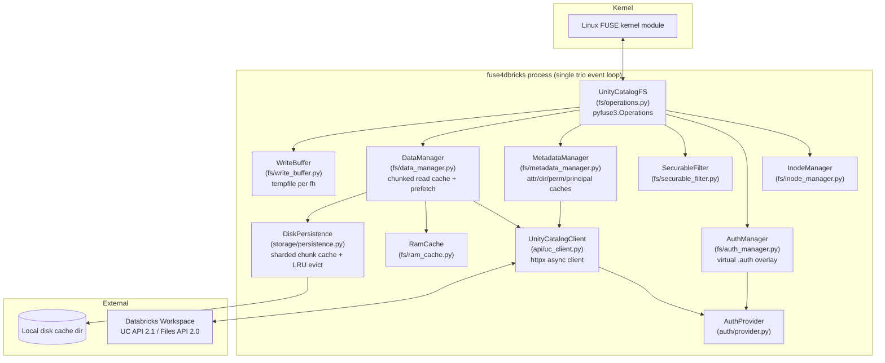
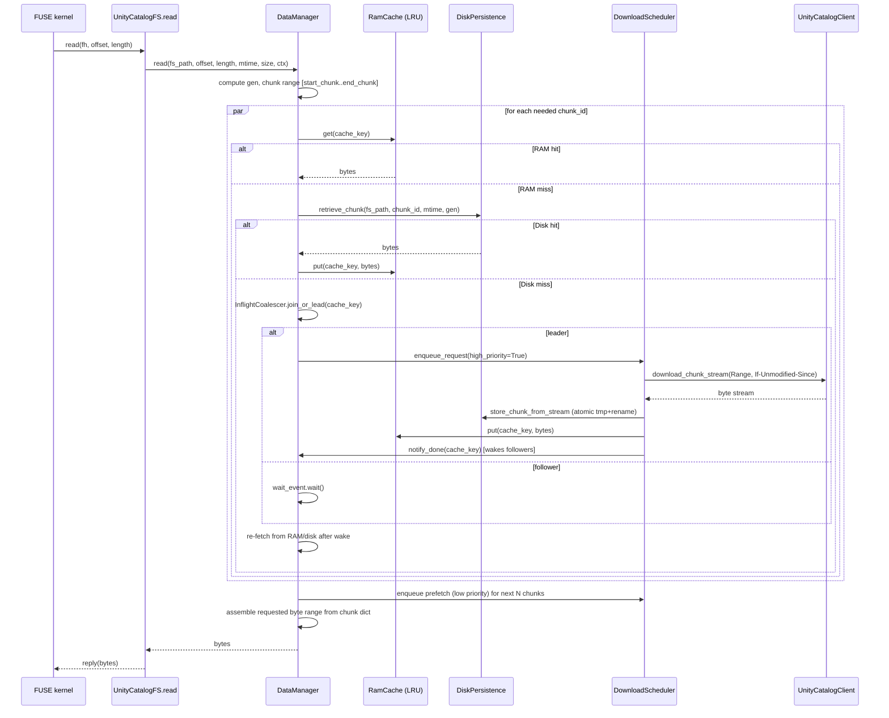
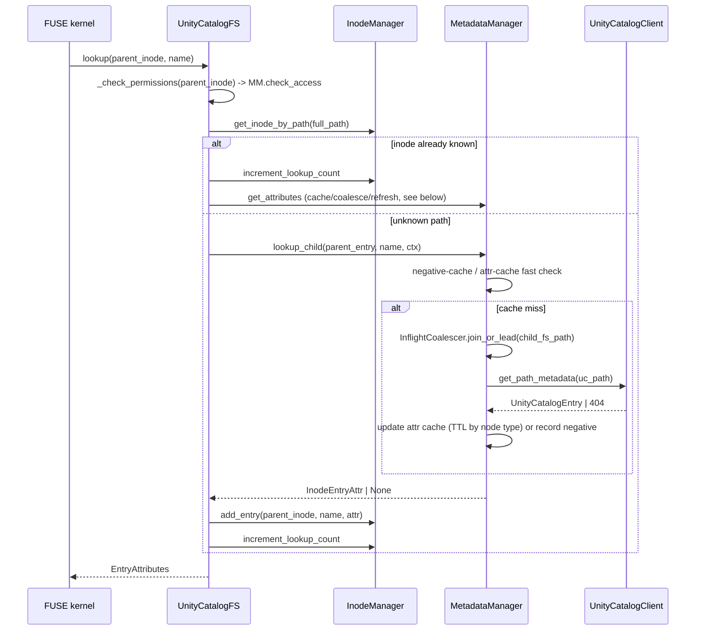
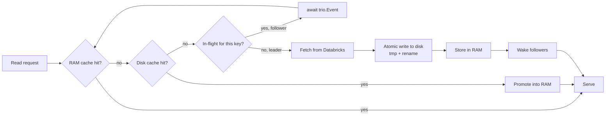
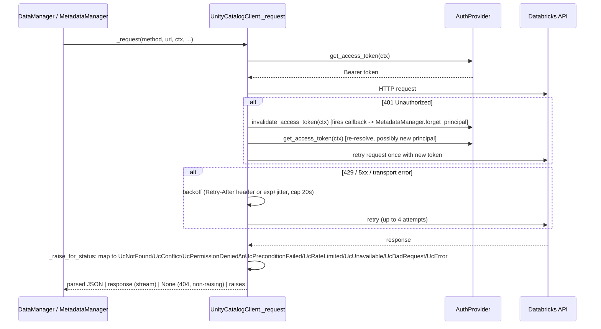
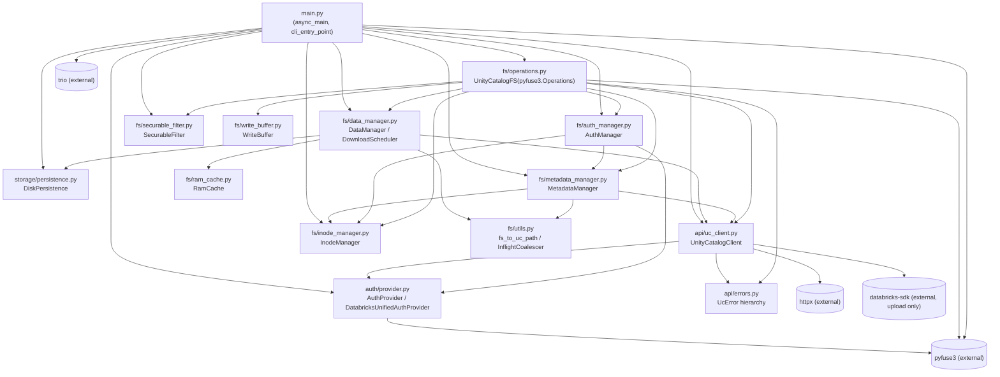

# fuse4dbricks — Architecture Review

Generated by static analysis of the repository on 2026-10-06. Read-only review; no code was modified.

Scope: `fuse4dbricks/main.py`, `fuse4dbricks/fs/*`, `fuse4dbricks/api/*`, `fuse4dbricks/auth/*`, `fuse4dbricks/storage/*`.

---

## 1. Architecture overview

fuse4dbricks is a trio-based, async, user-space filesystem (FUSE via `pyfuse3`) that exposes Databricks Unity Catalog Volumes as a local POSIX directory tree: `/catalog/schema/volume/...`. It is a single OS process with one trio event loop (no OS threads except `trio.to_thread` offloads for blocking disk/SDK calls).

**Layering:**

- **Kernel/FUSE boundary** — `main.py` mounts the filesystem via `pyfuse3.init/main/close` and drives a trio nursery that hosts all background services.
- **Operations layer** (`fs/operations.py`, class `UnityCatalogFS(pyfuse3.Operations)`) — implements every FUSE callback (`lookup`, `getattr`, `readdir`, `open`, `read`, `write`, `create`, `unlink`, `rename`, …), translating kernel requests into calls on the managers below and mapping domain errors to `errno`.
- **Identity/namespace layer**:
  - `fs/inode_manager.py` — in-memory inode table (inode ↔ fs_path ↔ parent/children), POSIX lookup-count/forget semantics.
  - `fs/securable_filter.py` — allow/deny filtering of catalog.schema.volume securables, applied in `lookup`/`readdir`/`create`/`rename`.
  - `fs/auth_manager.py` — a virtual "auth overlay" (`/.auth/personal_access_token`, `/README.txt`) layered onto the root, used to accept a manually-supplied PAT.
- **Metadata layer** (`fs/metadata_manager.py`) — caches attributes, directory listings, UC permission checks and uid→principal identity; coalesces concurrent identical requests; talks to `UnityCatalogClient` on cache miss.
- **Data layer** (`fs/data_manager.py`, `fs/ram_cache.py`, `storage/persistence.py`, `fs/write_buffer.py`) — chunked (8 MiB) read-through cache (RAM LRU → disk LRU → network) with background prefetch workers; writes are buffered to a local tempfile and uploaded whole on `flush`/`release`.
- **API client** (`api/uc_client.py`) — async `httpx` client wrapping Unity Catalog REST APIs (catalogs/schemas/volumes via UC API 2.1, file/directory I/O via Files API 2.0), with retry/backoff, 401 re-auth, and typed error mapping (`api/errors.py`).
- **Auth** (`auth/provider.py`) — per-uid Databricks token resolution: manually-set token > Databricks Unified Auth (reads the *requesting process's* environment/`~/.databrickscfg` via `/proc/<pid>/environ`) > optional single-principal mode.
- **Persistence** (`storage/persistence.py`) — sharded on-disk chunk cache with byte-budget + age-based lazy LRU eviction and crash-safe atomic (`tmp` → `rename`) writes.



---

## 2. Read path sequence

Two kinds of reads matter: **metadata reads** (`lookup`/`getattr`/`readdir`, routed through `MetadataManager`) and **data reads** (`read`, routed through `DataManager`). Both share the same pattern: fast in-memory cache check → request coalescing (single-flight) → real API call by the "leader" → followers wake and re-check the cache.

### 2.1 File data read (`read()`)



Key properties:
- **Chunk size**: 8 MiB (`DataManager.chunk_size`), independent of the kernel's own read-ahead/`max_read`.
- **Cache key** `(fs_path, chunk_id, mtime, gen)` — `mtime` detects remote changes (server `Last-Modified`, 1s resolution); `gen` is a local counter bumped on every write via `invalidate_path()` so a same-second overwrite can't collide with a stale chunk.
- **Prefetch**: after satisfying a read, up to 10 subsequent chunks are queued at low priority (1 chunk only if the read never left chunk 0 — avoids over-fetching on `head`).
- **Single-flight**: `InflightCoalescer` ensures only one network fetch per `cache_key` regardless of concurrent readers; all others await an `trio.Event`.
- A missing chunk after the wait (e.g. download failed) yields `None` → `operations.read` surfaces `FUSEError(EIO)`.

### 2.2 Metadata read (`lookup`/`getattr`/`readdir`)



- Attribute cache keys: `(fs_path, is_dir)`; **positive entries are global** (shared across principals) but **negative entries are keyed per-principal** so one user's 404 (possibly a masked permission denial) never falsely hides a path from another user.
- TTLs: `--metadata-cache-ttl-sec` (files/dirs, default 30s), `--metadata-cache-ttl-catalog-sec` (catalog/schema/volume nodes, default 600s), `--metadata-cache-ttl-negative-sec` (default 5s).
- `readdir` additionally caches full directory listings (`_dir_cache`, same TTL as plain entries) and opportunistically warms the attr cache for every child it sees.
- Permission checks (`check_access`) and uid→principal resolution (`_get_principal`) follow the identical cache→coalesce→API pattern, each with its own `InflightCoalescer` and TTL'd `OrderedDict` (LRU via `move_to_end`/`popitem`).

---

## 3. Write path sequence

Unity Catalog's Files API has no partial-write/append semantics, so fuse4dbricks buffers writes to a local tempfile and uploads the whole file on close.

```mermaid
sequenceDiagram
    participant K as FUSE kernel
    participant OPS as UnityCatalogFS
    participant WB as WriteBuffer (tempfile)
    participant DM as DataManager
    participant MM as MetadataManager
    participant UCC as UnityCatalogClient

    K->>OPS: open(inode, O_WRONLY|O_RDWR, [no O_TRUNC])
    OPS->>WB: new WriteBuffer(writes_dir)
    opt not O_TRUNC and size > 0
        loop stream existing content in chunk_size pieces
            OPS->>DM: read(fs_path, pos, len, mtime, size)
            DM-->>OPS: bytes
            OPS->>WB: write(pos, bytes)
        end
    end
    K->>OPS: write(fh, offset, buffer)  [may repeat many times]
    OPS->>WB: write(offset, buffer)
    OPS->>OPS: state["dirty"]=True; entry.attr.st_size updated
    K->>OPS: flush(fh)  [= close() syscall]
    OPS->>WB: flush_to_disk()
    OPS->>UCC: upload_file(uc_path, local_tmp_path)
    UCC-->>OPS: 200 OK | error
    alt success
        OPS->>MM: invalidate(fs_path, is_dir=False)
        OPS->>DM: invalidate_path(fs_path)  [bump gen]
        OPS->>OPS: state["dirty"]=False
    else failure
        OPS-->>K: EIO  (remote file left unchanged, cache NOT invalidated)
    end
    K->>OPS: release(fh)
    OPS->>OPS: _upload_if_dirty (no-op if flush already succeeded)
    OPS->>WB: close() [unlink tempfile]
```

Notable design points:
- **Read-before-write pre-load**: a writable `open()` without `O_TRUNC` streams the existing remote content into the write buffer first (in `chunk_size` pieces, so memory stays O(chunk_size)), because POSIX allows a partial write to leave untouched bytes intact — without pre-loading, a partial rewrite would truncate the remote file.
- **Upload timing**: the real upload happens in `flush()` (mapped to the `close()` syscall, whose return code the caller actually observes), not only in `release()` (async, errors discarded by the kernel). `release()` is a no-op fallback if `flush` already cleared the dirty flag.
- **Upload mechanism**: `uc_client.upload_file` uses the Databricks SDK's `WorkspaceClient.files.upload` (not the raw PUT in `_request`), so multipart upload activates automatically above the SDK's internal size threshold (>5 GB). This runs in `trio.to_thread.run_sync` since the SDK client is synchronous/blocking.
- **Cache busts on success only**: `MetadataManager.invalidate()` drops the attr cache entry + parent dir-cache entry + any stale negative, and also calls `pyfuse3.invalidate_entry_async` / `invalidate_inode` so the **kernel's own** dentry/attribute/page cache doesn't serve stale state. `DataManager.invalidate_path()` bumps the per-path generation counter so previously-cached read chunks become unreachable (not explicitly deleted — they just age out of the LRUs).
- **Failure handling**: on upload failure the remote file is untouched, so caches are deliberately *not* invalidated — avoids treating a failed write as if it happened.
- **Other mutations** (`create`, `mkdir`, `unlink`, `rmdir`, `rename`) go directly to `uc_client` (no buffering) and then call `inodes.detach_path` / `metadata_manager.invalidate` / `data_manager.invalidate_path` as appropriate. `rename` of a directory is rejected with `EXDEV` (Files API has no atomic directory move), causing `mv` to fall back to copy+delete at the caller.
- **Auth overlay writes** (`/.auth/personal_access_token`) bypass `WriteBuffer`/UC entirely: `AuthManager` buffers bytes in a dict keyed by `(fs_path, uid)` and, on `release`, calls `AuthProvider.set_access_token` + `MetadataManager.reauthorize`.

---

## 4. Cache flow

fuse4dbricks layers independent caches, each with its own TTL/eviction policy and all coordinated via **request coalescing** (`InflightCoalescer`) to prevent thundering-herd API calls.

| Cache | Location | Key | Eviction | Purpose |
|---|---|---|---|---|
| Attribute cache | `MetadataManager._attr_cache` | `(fs_path, is_dir)` | TTL (30s / 600s for catalog-level) + `max_entries` LRU | avoid re-`stat`/HEAD on every `getattr`/`lookup` |
| Negative cache | `MetadataManager._negative_cache` | `(principal, fs_path)` | TTL (5s) + LRU | cache "not found" per-identity, short-lived so creates become visible quickly |
| Directory listing cache | `MetadataManager._dir_cache` | `fs_path` | TTL (30s/600s) | avoid repeated `readdir`→listing API calls |
| Permission cache | `MetadataManager._permissions_cache` | `(principal, securable)` | TTL (30s or 600s for catalog/schema) + LRU | avoid an effective-permissions API call per access check |
| Principal cache | `MetadataManager._principal_cache` | `uid` | LRU, explicitly dropped on 401 via callback | map OS uid → Databricks identity string |
| RAM chunk cache | `fs/ram_cache.py` `RamCache` | `(fs_path, chunk_id, mtime, gen)` | pure LRU, size bound = `ram_cache_mb / 8MiB` entries | fastest tier for hot chunks |
| Disk chunk cache | `storage/persistence.py` `DiskPersistence` | same key, sharded path | byte-budget LRU (`--disk-cache-gb`) + age (`--disk-cache-max-days`, checked hourly) + startup `--clear-cache` | durable, larger-than-RAM tier, survives process restarts |



**Invalidation triggers** (all funnel through `MetadataManager.invalidate()` + `DataManager.invalidate_path()`):
- Successful upload (`flush`/`release` on a dirty handle).
- `mkdir`, `unlink`, `rmdir`, `rename` (source and, if applicable, overwritten destination).
- Token change for a uid (`AuthProvider` invalidation callback → `MetadataManager.forget_principal`, dropping only the uid→principal mapping; permission/attr caches are keyed by principal so they age out naturally instead of being purged).
- 412 Precondition Failed (`If-Unmodified-Since` mismatch) surfaces as `ESTALE` to the kernel rather than silently serving stale bytes, prompting the caller to re-stat/re-read.

Background maintenance (`DiskPersistence._background_maintenance`, hourly): checks real disk free-space (critical if <5% free) and evicts chunks past `max_age_days`, independent of the per-request LRU eviction that runs inline on every `store_chunk_from_stream` when the size budget is exceeded.

---

## 5. FUSE interaction flow

`main.py` owns the single `pyfuse3` integration point. All FUSE callbacks are `async def` methods on `UnityCatalogFS` and run cooperatively on trio's event loop — `pyfuse3` is built specifically to bridge the kernel's synchronous low-level FUSE protocol into trio's async model.

```mermaid
sequenceDiagram
    participant User as User process (e.g. `cat`, `ls`)
    participant Kernel as Linux kernel FUSE
    participant Main as main.py
    participant Nursery as trio nursery
    participant OPS as UnityCatalogFS

    Main->>Main: parse_args, setup_logging, create cache dirs
    Main->>Main: construct AuthProvider, UnityCatalogClient,\nDiskPersistence, InodeManager, DataManager,\nMetadataManager, AuthManager, SecurableFilter, OPS
    Main->>Nursery: open_nursery()
    Nursery->>Nursery: persistence.run_services (graceful_init, background_maintenance)
    Nursery->>Nursery: data_manager.run_services (N download workers)
    Nursery->>Nursery: start_soon(_shutdown_on_signal)
    Nursery->>Nursery: start_soon(start_fuse, OPS, mountpoint)
    Main->>Kernel: pyfuse3.init(OPS, mountpoint, options)
    Main->>Kernel: await pyfuse3.main()  [kernel request loop]

    User->>Kernel: syscall (open/read/write/...)
    Kernel->>OPS: dispatch to matching async method
    OPS-->>Kernel: reply / FUSEError(errno)
    Kernel-->>User: syscall result

    Note over Main,Nursery: SIGTERM/SIGINT/SIGHUP
    Nursery->>Nursery: cancel_scope.cancel() (via _shutdown_on_signal)
    Main->>Kernel: pyfuse3.close(unmount=True) [in start_fuse's finally]
    Main->>Main: data_manager.close(); uc_client.close()
```

- **Mount options**: `fsname=fuse4dbricks`, `noatime`, optionally `allow_other` and `debug`.
- **Concurrency model inside `UnityCatalogFS`**: file handles (`_open_state`) and readdir cursors (`_readdir_state`) are plain dicts keyed by an incrementing integer counter — **not reused/recycled** and not trio-locked, relying on the fact that handle allocation (`self._open_fh_count += 1`) is a synchronous, non-yielding operation so it's atomic under trio's cooperative scheduling.
- **Dentry/attribute cache coherency with the kernel**: every mutating operation (and cache invalidation) explicitly calls `pyfuse3.invalidate_entry_async` / `pyfuse3.invalidate_inode` so the kernel's own VFS cache doesn't disagree with the backend after a write/delete/rename.
- **Inode lookup-count discipline**: every reply that hands the kernel an `EntryAttributes` (`lookup`, `create`, overlay/readdir entries) pins the inode first (`increment_lookup_count`) *before* any `await`, so a racing `forget()` can't free an inode the kernel still references; a failed reply path explicitly unwinds the pin.
- **Graceful shutdown**: `_shutdown_on_signal` converts SIGTERM/SIGINT/SIGHUP into a nursery cancellation so `pyfuse3.close(unmount=True)` always runs — otherwise SIGTERM would kill the process and leave a stale/broken mount.

---

## 6. Databricks API interaction flow

All HTTP traffic is centralized in `UnityCatalogClient` (`api/uc_client.py`), which wraps a single shared `httpx.AsyncClient` (`max_keepalive_connections=20`, `max_connections=50`, `connect=10s/read=60s/write=10s/pool=30s` timeouts).

**API surfaces used:**
- **Unity Catalog API 2.1** — `/api/2.1/unity-catalog/{catalogs,schemas,volumes}` (listing/metadata) and `/api/2.1/unity-catalog/effective-permissions/{type}/{securable}` (permission checks). Also `/api/2.0/preview/scim/v2/Me` for identity resolution.
- **Files API 2.0** — `/api/2.0/fs/files{path}` (HEAD for metadata, GET with `Range`+`If-Unmodified-Since` for chunked download, DELETE) and `/api/2.0/fs/directories{path}` (HEAD/GET listing with pagination, PUT create, DELETE).
- **Databricks SDK** (`databricks.sdk.WorkspaceClient.files.upload`) for uploads only, invoked off the event loop via `trio.to_thread.run_sync`, enabling automatic multipart upload for large files.



**Error taxonomy** (`api/errors.py`) and their FUSE mapping (`operations._raise_fuse_error`):

| HTTP status | Domain exception | errno |
|---|---|---|
| 401/403 | `UcPermissionDenied` | `EACCES` |
| 404 | `UcNotFound` | `ENOENT` |
| 400 | `UcBadRequest` | `EINVAL` (or `ENOTEMPTY` for non-empty `rmdir`) |
| 409 | `UcConflict` | `EEXIST` |
| 412 | `UcPreconditionFailed` | `ESTALE` |
| 429 / 5xx (after retries exhausted) | `UcRateLimited` / `UcUnavailable` | `EAGAIN` |
| other | `UcError` | `EIO` |

**Resilience behaviors:**
- Retries apply uniformly to httpx-path errors and SDK-path transient errors (`TooManyRequests`, `TemporarilyUnavailable`, `InternalError`, `DeadlineExceeded`), up to 4 attempts with exponential backoff + full jitter (capped 20s), honoring server `Retry-After`.
- A 404 on GET is translated to `None` by default (expected "not found" for read paths) but can be forced to raise (`raise_on_not_found=True`) for write/delete operations where absence is an error.
- `If-Unmodified-Since` on chunk downloads guards against reading a file that changed mid-multi-chunk-read; a 412 surfaces as `ESTALE`.
- Path resolution is hierarchical and request-count-aware: `get_path_metadata`/`get_path_contents` branch on path depth (catalog → schema → volume → file/directory) to call the cheapest matching endpoint, avoiding unnecessary HEAD requests at the catalog/schema/volume levels.

---

## 7. Async execution model

The entire process is a single trio event loop (`trio.run(async_main)`); there are **no OS threads** except trio's internal thread pool used for blocking operations (`trio.to_thread.run_sync`).

**Concurrency primitives used throughout:**
- `trio.Lock` — guards each cache's `OrderedDict` (`MetadataManager._cache_lock`, `_permissions_lock`, `_principal_cache_lock`; `RamCache._lock`; `DiskPersistence.lock`; `DownloadScheduler._requests_lock`).
- `trio.Event` — the payload of `InflightCoalescer`; a "leader" performs work, "followers" await the event, woken via `notify_done`.
- `trio.open_memory_channel` (buffer size 1) — `DownloadScheduler`'s wake signal so idle download workers block without polling.
- `trio.Nursery` — structured concurrency at three levels:
  1. **Top-level** (`async_main`): hosts persistence services, data-manager download workers, the FUSE main loop, and the signal-shutdown task. Cancelling this nursery's scope (via `stopped_evt`/SIGTERM handling) tears down the whole mount cleanly.
  2. **Per-multi-chunk-read** (`DataManager.read`): spawns one task per chunk when a read spans more than one chunk, so chunks download concurrently.
  3. Implicit per-request concurrency from `pyfuse3`: each kernel request becomes its own trio task, so many `getattr`/`read`/`write` calls run concurrently by default — serialization only happens where locks/coalescers are explicitly taken.
- `trio.to_thread.run_sync` — used for all blocking file-system syscalls in `DiskPersistence` (`os.walk`, `open/read/write`, `os.rename`, `os.remove`, `shutil.disk_usage`) and for the synchronous Databricks SDK upload call, keeping the event loop responsive.

```mermaid
graph TD
    subgraph "trio.run(async_main)"
        NUR["Top-level nursery"]
        NUR --> SVC1["persistence.run_services\n(_graceful_init, _background_maintenance)"]
        NUR --> SVC2["data_manager.run_services\n(N DownloadScheduler workers)"]
        NUR --> SIG["_shutdown_on_signal\n(SIGTERM/SIGINT/SIGHUP -> cancel_scope.cancel())"]
        NUR --> FUSE["start_fuse\n(pyfuse3.init + await pyfuse3.main())"]
    end
    FUSE -.spawns task per request.-> REQ1["getattr task"]
    FUSE -.spawns task per request.-> REQ2["read task"]
    FUSE -.spawns task per request.-> REQ3["write task"]
    REQ2 -->|multi-chunk| SUBNUR["per-read nursery\n(one task per chunk)"]
    SVC2 --> W1["downloader worker 1"]
    SVC2 --> W2["downloader worker N"]
    W1 -. trio.to_thread .-> DISKIO["blocking disk I/O"]
    FUSE -. upload via SDK .-> SDKIO["trio.to_thread: WorkspaceClient.files.upload"]
```

**Key safety invariants relied upon (documented in code comments):**
- Operations between two `await` points are treated as atomic (no other task can interleave) — e.g. handle-counter increments, inode pin-before-`getattr`-await, cache lookup+LRU-touch sequences guarded only where an `await` actually occurs inside the critical section.
- Download worker exceptions are caught inside the worker loop (`_downloader`) so a single failed chunk fetch cannot propagate and tear down the whole nursery/mount; `trio.Cancelled` is deliberately allowed to propagate for shutdown.

---

## 8. Component dependency graph



**Dependency direction notes:**
- `operations.py` is the only module that imports `pyfuse3.Operations`/`FUSEError` pervasively and is the single integration seam with the kernel; all managers below it are plain async classes with no FUSE-specific types in their public surface (aside from accepting `pyfuse3.RequestContext` for uid/pid/gid and raising `pyfuse3.FUSEError` in a few error paths).
- `MetadataManager` and `DataManager` do not depend on each other directly; `operations.py` coordinates cross-cutting invalidation (`metadata_manager.invalidate` + `data_manager.invalidate_path`) after writes/deletes/renames.
- `AuthManager` depends on `MetadataManager` only for `reauthorize()` (re-deriving uid→principal after a manually-supplied token changes) — it does not use `MetadataManager`'s caches for its own virtual files.
- `fs/utils.py` (`InflightCoalescer`, path-translation helpers) is a shared, dependency-free utility imported by both `MetadataManager` and `DataManager`.
- No module imports `fs/operations.py` — it is a leaf consumer, confirming a clean layered (DAG) dependency structure with no cycles.
