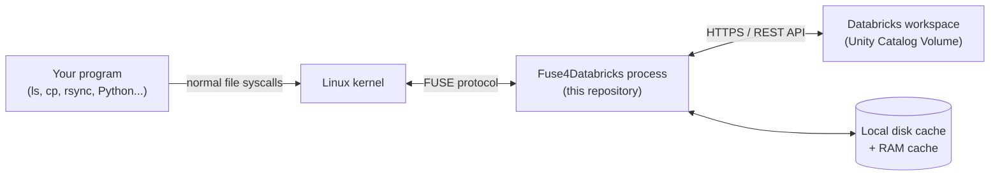
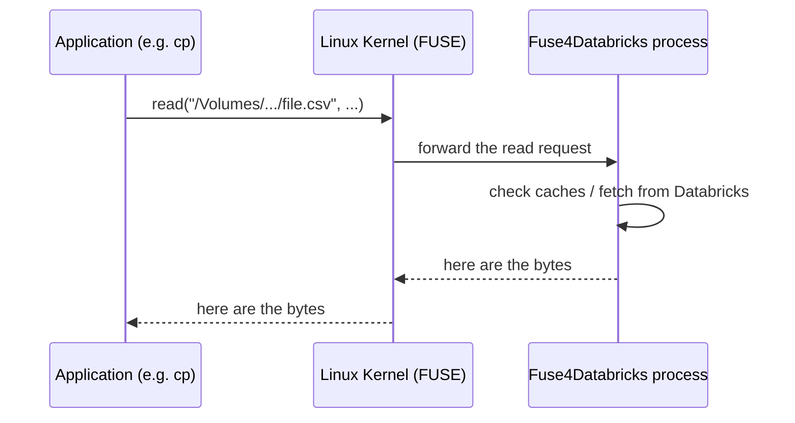
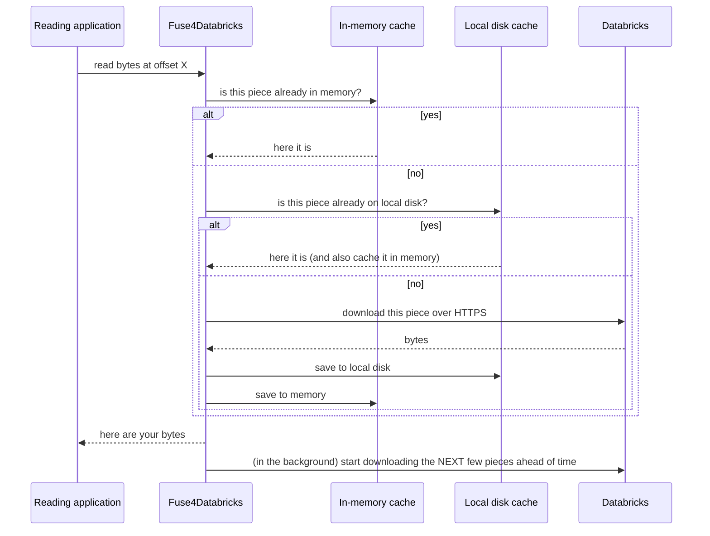
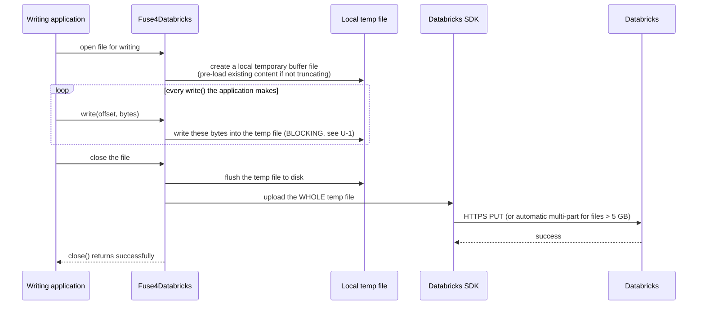

# Fuse4Databricks — Performance Improvement Roadmap

**Audience**: this document assumes no prior knowledge of FUSE, `pyfuse3`, or this codebase. Every technical term is explained the first time it's used.

**Method**: every claim in this document is grounded in reading the actual source code (and, where relevant, the actual installed `pyfuse3` library source and the Linux `fuse(8)` manual) — not general assumptions. Where something cannot be confirmed without running a live benchmark, that is stated explicitly rather than assumed. No code was modified to produce this document.

This document consolidates and extends four prior reviews: [architecture-review.md](architecture-review.md), [test-gap-analysis.md](test-gap-analysis.md), [optimization-review.md](optimization-review.md), and the individual deep-dives [P01-analysis.md](P01-analysis.md), [P02-analysis.md](P02-analysis.md), [P03-analysis.md](P03-analysis.md).

---

## SECTION 1 — Executive Summary

### What this system does, in one paragraph

Fuse4Databricks makes a Databricks "Unity Catalog Volume" (a cloud storage location) appear as an ordinary folder on a Linux machine (e.g., a Posit Workbench server), so that any program — `ls`, `cp`, `rsync`, R, Python, a Jupyter notebook — can read and write files there using completely normal file operations, with no Databricks-specific code. It does this by acting as a translator that sits between the Linux kernel and the Databricks cloud API.

### High-level architecture summary

Fuse4Databricks is a single Linux process. Internally it is organized into clear layers: a layer that speaks the kernel's FUSE protocol, a layer that tracks file/folder identities, two caching layers (fast in-memory and slower on-disk), and a layer that speaks to Databricks over HTTPS. Everything runs as cooperatively-scheduled asynchronous Python code (`trio`) inside one process — there is no thread pool doing the actual file-serving work (a few specific operations are offloaded to background threads, which matters later in this document).

### Main bottlenecks discovered

Ranked by how directly they affect the stated business objectives (download speed, upload speed, `cp` performance, large/TB-scale transfers, overall responsiveness):

| # | Bottleneck | Affects | Confirmed how |
|---|---|---|---|
| 1 | **Every single `write()` call blocks the entire process**, not just the file being written | Upload speed, `cp` performance, overall responsiveness | Direct source read: the write-buffering class performs plain, un-threaded disk I/O inside `async` handler methods. |
| 2 | **A large file must be fully written to local disk before any of it is uploaded** (no overlap between "receiving the write" and "sending to Databricks") | Upload speed, TB-scale transfers | Direct source read: upload is only triggered once a file handle is closed; local writes and the network upload never happen concurrently for the same file. |
| 3 | **A finished chunk download isn't handed to the waiting reader until after it's fully saved to disk** (including, in the worst case, an unbounded disk-cleanup pass) | Download speed, TB-scale transfers | Direct source read + exact task-level trace, see [P01-analysis.md](P01-analysis.md). |
| 4 | **Metadata requests (the equivalent of `ls`/`stat`) can get stuck in line behind large downloads**, because both share one pool of network connections | Overall responsiveness during concurrent transfers | Direct source read + quantified worst case, see [P03-analysis.md](P03-analysis.md). |
| 5 | **A single large file's upload is not accelerated using multiple parallel network streams** (unless the Databricks SDK's own automatic threshold, >5 GB, kicks in) | Upload speed, TB-scale transfers | Direct source read of the upload call. |
| 6 | **A fresh network client/session is created for every single file upload**, instead of being reused | Upload speed (many small/medium files) | Direct source read. |
| 7 | A kernel feature that lets Linux batch up small writes before handing them to this filesystem (**"write-back caching"**) is available but turned off | Upload speed, `cp` performance | Confirmed against the installed `pyfuse3` library's default settings, which this repository never overrides. |

### What is already working well (evidence, not assumption)

To be fair and accurate, several things investigated turned out **not** to be problems:
- Linux's normal page cache (the memory Linux already uses to speed up file access) is **not** disabled for this filesystem — confirmed against `pyfuse3`'s actual defaults. Repeated reads of the same data, or multiple users reading the same file, can be served by the kernel for free without ever reaching this process.
- This filesystem already tells the kernel to drop its cached copy of a file the moment that file changes through the mount — so the above caching does not create a stale-data risk.
- Directory listings already come back with full file details in one round trip (so `ls -la` does not need one network request per file).
- The download path already avoids redundant network requests for the same piece of data when multiple reads overlap (request "coalescing").

### Top recommendations (details in Sections 6–9)

1. Stop every `write()` call from blocking the whole process (low effort, high value).
2. Turn on the kernel's write-back caching feature (a one-line, officially-supported configuration change).
3. Stop a finished download from waiting on a disk cleanup pass before being handed to the reader.
4. Reuse one network client across uploads instead of creating a new one per file.
5. Give metadata requests (`ls`/`stat`) their own pool of network connections, separate from downloads.
6. Investigate (not yet implement) overlapping "receiving a write" with "sending it to Databricks" for very large sequential uploads — this is the single highest-ceiling improvement for TB-scale uploads, and also the riskiest and most complex.

### Expected performance gains

Stated honestly: **no numeric gain is claimed anywhere in this document without a benchmark to back it**, per the instructions this review was produced under. Where a benchmark hasn't been run, this document says so explicitly and recommends what to measure. In qualitative terms: items 1–2 are expected to improve write/`cp`/responsiveness noticeably at very low implementation risk; items 3–5 are expected to help most under sustained, large, or concurrent transfer load rather than light usage; item 6 has the largest theoretical ceiling but requires real measurement before committing to it.

---

## SECTION 2 — How Fuse4Databricks Works

### What Fuse4Databricks does

It takes a Databricks cloud storage volume and makes it show up as a regular folder — e.g., `/Volumes/my_catalog/my_schema/my_volume` — on a Linux machine. Any program that can open, read, write, or list files can use it immediately, with zero code changes, because from the program's point of view it's just a folder like any other.

### Why FUSE is used

Teaching every single program on the machine how to talk to Databricks directly would be impractical. **FUSE** ("Filesystem in Userspace") is a Linux kernel feature that lets an ordinary program (not a kernel driver) implement a filesystem. The kernel forwards every relevant file operation (open a file, read some bytes, list a folder, etc.) to that ordinary program, waits for its answer, and returns that answer to whichever program made the original request — all transparently. Fuse4Databricks is exactly that "ordinary program": it receives these forwarded requests and answers them by talking to Databricks (and its own caches) instead of a real local disk.

### How Linux interacts with the filesystem

Every one of these round trips costs a small amount of time (switching between the application, the kernel, and this process). That overhead is usually invisible for small, everyday use, but it adds up when a workload makes an enormous number of these round trips in a short time — which is exactly what large sequential file transfers and bulk metadata scans (`find`, `rsync`) do. Several of the bottlenecks in this document are specifically about reducing how many of these round trips, and how much blocking, a large transfer causes.

### How Databricks is accessed

Fuse4Databricks does not have any special, private connection to Databricks — it uses the exact same public REST APIs ("Unity Catalog API" for browsing catalogs/schemas/volumes, and "Files API" for actual file content) that any external tool could use, over regular HTTPS. There is no shortcut or private protocol; every read, write, directory listing, and permission check is an HTTPS request to the Databricks workspace.

### What happens for common commands

**`ls` (list a directory):** Linux asks this process "what's in this folder?" once. This process either answers from its own in-memory cache (if it asked Databricks recently and the answer hasn't expired) or makes one HTTPS request to Databricks, which returns the full list **with full details per file already included** (size, modified date, etc.) — so a typical `ls -la` does not need a second round trip per file.

**`cat` / reading a file:** Linux asks for bytes at a specific offset. This process checks: is it already in fast memory? If not, is it already saved on local disk from a previous download? If not, it downloads it from Databricks — in 8 MB pieces — saves that piece to local disk and memory, and also proactively starts downloading the *next several* pieces in the background, anticipating that the read is sequential (as in a typical `cat`/`cp`).

**`cp` (Databricks → Posit):** this is just a loop of "open the Databricks-side file" + repeated reads (as above) + "write each block to the Posit-side file" (a completely normal local file on Posit, nothing to do with this filesystem).

**`cp` (Posit → Databricks):** the reverse — a loop of reads from a normal Posit file + writes into the Databricks-mounted folder. Every one of those writes is buffered locally by this process (into a temporary file), and only when the application finally closes the file does this process upload the *entire* finished file to Databricks in one go. This buffer-then-upload design, and its consequences, is the subject of Section 4.

**`rsync`:** functionally a smarter `cp` — it does extra metadata work first (comparing file sizes/dates on both sides, i.e., many small "is this file already up to date?" checks) before deciding what to actually transfer. This makes `rsync` a heavier **metadata** workload than a plain `cp`, which is directly relevant to the "metadata starvation" bottleneck described in Section 3.

---

## SECTION 3 — Download Flow Analysis

### Complete Databricks → Posit path

### Cache behavior

Two caching layers exist: a fast, limited-size in-memory cache (default budget: 512 MB), and a larger, slower on-disk cache (default budget: 10 GB, configurable, with automatic cleanup of old data). Both are keyed so that a change to the real file (or a local write made through this mount) makes the old cached copy unreachable rather than serving stale data.

### Chunk handling

Files are not downloaded as a whole — they are split into fixed 8 MB pieces ("chunks"). A read only triggers a download of the specific chunk(s) it actually overlaps. After serving a read, the system additionally starts downloading the *next* several chunks in the background (up to 10 ahead), on the assumption that most reads are sequential (true for `cat`/`cp`/typical data-processing workloads).

### HTTP requests

Every chunk download, every directory listing, and every permission/identity check is a separate HTTPS request. All of these currently share **one single pool of up to 50 simultaneous network connections** per mounted filesystem process.

### Worker scheduling

Chunk downloads are handled by a fixed pool of 10 background "worker" tasks (not configurable today without a code change). On-demand downloads (something is actively waiting for this exact data) are prioritized ahead of background prefetch downloads (nothing is waiting yet, this is a bet on future reads) in a simple two-tier priority queue.

### Potential bottlenecks (download path)

#### D-1: A finished download isn't released to the waiting reader until disk bookkeeping finishes

- **Root cause**: once a downloaded chunk is fully received, the code first writes it to a temporary file, renames it into place, and then runs a cache-cleanup pass (deleting old chunks if the disk cache is near its configured size limit) — and only *after all of that* does it tell the waiting reader "your data is ready." The cleanup pass in particular can delete an unpredictable number of old files in a loop.
- **Impact**: the reader's wait time includes this entire bookkeeping+cleanup sequence, even though the actual bytes were already fully known in memory much earlier.
- **Severity**: Medium (High specifically when the local disk cache is near its configured size limit, since the cleanup pass then has real work to do).
- **Evidence in code**: traced exact task-by-task in [P01-analysis.md](P01-analysis.md) §1, with file/line references into [fs/data_manager.py](../../fuse4dbricks/fs/data_manager.py) and [storage/persistence.py](../../fuse4dbricks/storage/persistence.py).

#### D-2: Metadata requests can be delayed behind in-progress downloads

- **Root cause**: downloads and metadata lookups (`ls`/`stat`) share the exact same pool of network connections. A single chunk download can hold one connection for as long as it takes to stream 8 MB over the network — much longer than a typical metadata request. If enough connections are busy with downloads, a metadata request has to wait its turn for a free connection.
- **Impact**: during a large, sustained download, unrelated `ls`/`stat`/file-browsing activity can become noticeably slower or (in a worst case quantified in the linked analysis) stall for an extended period before an automatic retry mechanism even kicks in.
- **Severity**: Medium at today's default settings (10 download workers vs. 50 total connections leaves headroom); becomes High if download concurrency is ever increased without also addressing this.
- **Evidence in code**: quantified worst-case math, with the exact configuration values involved, in [P03-analysis.md](P03-analysis.md) §2.

#### D-3: The download request size the kernel is willing to make is not something this project currently controls

- **Root cause**: Linux limits how much data can be requested in a single read request forwarded to this process. Raising that limit requires a feature this project's underlying library (`pyfuse3`) does not expose a way to use.
- **Impact**: a single logical 8 MB chunk may be delivered to this process as several smaller kernel requests rather than one, adding minor per-request overhead (not extra network cost — only the very first of those smaller requests triggers an actual download; the rest are served from the cache populated by that first request).
- **Severity**: Low. (Full root-cause chase, including inspecting `pyfuse3`'s actual source code, is in [P02-analysis.md](P02-analysis.md); conclusion: **not actionable as originally proposed** — see Section 7.)

#### D-4: Fixed chunk size and fixed worker count are not tunable without editing code

- **Root cause**: the 8 MB chunk size and the "10 simultaneous downloads" worker count are hardcoded constants, not command-line options.
- **Impact**: cannot be tuned per-environment (e.g., a very high-bandwidth link to Databricks might benefit from bigger chunks and/or more simultaneous downloads; a constrained link might want the opposite) without a code change and a new release.
- **Severity**: Low–Medium (a tuning limitation, not a bug — today's defaults are reasonable, just not adjustable).

---

## SECTION 4 — Upload Flow Analysis

### Complete Posit → Databricks path

### `WriteBuffer` usage

Every file opened for writing through this mount gets its own private temporary file (a `WriteBuffer`) on local disk. All writes the application makes are recorded into this temporary file, at the correct offsets — this is necessary because a program can write to a file in any order (seek backward, overwrite part of it, etc.), and Databricks' file-upload API has no equivalent of "patch these specific bytes" — only "here is the complete file, please store it."

### Temporary files

If a file is opened for writing **without** asking to truncate it (i.e., the application might only be changing part of the file), this process first downloads the *entire existing file* from Databricks into the temporary buffer, so that any bytes the application doesn't touch are preserved correctly. Only then does it start applying the application's writes on top.

### Upload process

Nothing is sent to Databricks until the application closes the file (or explicitly flushes it, which is what happens on the `close()` system call). At that point, the entire temporary file — however large — is handed, as one unit, to the Databricks SDK to upload.

### Databricks SDK interaction

Uploads do not use this project's own HTTPS client at all — they construct a separate, official Databricks SDK client (`WorkspaceClient`) and ask it to upload the file. The SDK automatically switches to a parallel "multi-part" upload strategy on its own, but — per this project's own code comments — only for files larger than about 5 GB.

### Potential bottlenecks (upload path)

#### U-1: Every single `write()` call blocks the entire process, not just the file being written

- **Root cause**: the code that records a write into the local temporary buffer file performs **plain, synchronous, unprotected disk I/O** — it does not use any of the "run this on a background thread" techniques that every other disk operation in this codebase carefully uses. Since this whole process is built around cooperative scheduling (many tasks taking turns, never truly running at the same time, each expected to "give way" quickly), a function that blocks without giving way freezes *every other task in the entire process* for as long as that one disk write takes — every other file's reads, every other file's writes, every in-progress download, every metadata lookup, for every user of this mount, all pause.
- **Impact**: for a write-heavy workload (e.g., `cp`-ing a large file into Databricks), this means the *entire filesystem*, for *all users and all files*, repeatedly pauses for the duration of each local disk write, for as long as the upload-in-progress file keeps being written to.
- **Severity**: **High**. This is the most impactful issue found in this review precisely because its blast radius is the whole process, not just the file being uploaded.
- **Evidence in code**: the buffering class's `write`/`read`/`truncate`/`flush_to_disk`/`finalize` methods all call the underlying file object's blocking methods directly, with no thread offloading, in [fs/write_buffer.py](../../fuse4dbricks/fs/write_buffer.py), and are invoked directly from `async` FUSE handler methods in [fs/operations.py](../../fuse4dbricks/fs/operations.py). Full trace in [P01-analysis.md](P01-analysis.md)'s "Related finding."

#### U-2: A file cannot start uploading until it has been completely written

- **Root cause**: this process has no mechanism to begin sending data to Databricks while the application is still writing it — the design (buffer the whole file locally, then upload the whole thing) is a direct and reasonable consequence of Databricks' Files API having no "append" or "patch these bytes" operation. But the consequence is that for a very large file, the *entire* local write time and the *entire* upload time happen one after another, never overlapping.
- **Impact**: for a 100 GB file, if writing it to local disk takes (for example) a few minutes and uploading it takes several more, the total time is the **sum** of both, not the larger of the two. This directly works against the "TB-scale sequential transfers" business objective.
- **Severity**: **High** for very large files specifically; low impact for small files (the buffering overhead is proportionally tiny).
- **Evidence in code**: upload is only triggered from the `flush`/`release` FUSE handlers — i.e., only once the application is done writing — in [fs/operations.py](../../fuse4dbricks/fs/operations.py) (`_upload_if_dirty`); there is no code path that starts an upload earlier.

#### U-3: No application-level parallelism for a single file's upload

- **Root cause**: one `upload_file` call hands the whole file to the SDK as a single operation. Parallel/multi-part upload is entirely the SDK's own internal decision, and — per this project's own code comment — only activates above roughly 5 GB.
- **Impact**: for files in the (very common) 1 GB–5 GB range named in this project's own benchmark plan, the upload is a single network stream, so its speed is capped by that one stream's throughput rather than being able to use multiple parallel streams the way the download side already somewhat benefits from (multiple chunks can download concurrently for different parts of the same file).
- **Severity**: Medium. Needs measurement — it's possible the SDK or the underlying network path already saturates available bandwidth with a single stream, in which case this would not help; it's also possible it doesn't, in which case this could meaningfully help the 1–10 GB upload benchmarks specifically.
- **Evidence in code**: `upload_file`'s single call to the SDK's `files.upload(...)`, in [api/uc_client.py](../../fuse4dbricks/api/uc_client.py).

#### U-4: A brand-new network client is created for every single upload

- **Root cause**: each call to upload a file constructs a **new** Databricks SDK client object from scratch, rather than reusing one client across multiple uploads.
- **Impact**: every file upload pays the full cost of establishing a new secure network connection (the equivalent of "dialing a new phone call" instead of reusing one already open), instead of reusing an already-open, already-authenticated connection. For many-small-to-medium-files transfers, this overhead repeats on every single file.
- **Severity**: Medium (grows directly with the number of files uploaded; close to irrelevant for a single giant file, significant for many files).
- **Evidence in code**: `_do_upload`'s construction of a fresh `WorkspaceClient` on every call, in [api/uc_client.py](../../fuse4dbricks/api/uc_client.py). Independently confirmed in [P03-analysis.md](P03-analysis.md) §1.3.

#### U-5: The kernel's "batch up small writes" feature is available but not turned on

- **Root cause**: Linux/FUSE supports a mode ("write-back caching") where the kernel itself batches up a program's small, frequent writes and hands them to a filesystem like this one in fewer, larger pieces — directly reducing the number of times U-1's blocking write function gets called. This project's underlying library (`pyfuse3`) exposes this as a simple yes/no setting that this project leaves at its default (off).
- **Impact**: every single `write()` the application makes currently reaches this process's code individually; turning this on would let the kernel coalesce many small writes into fewer, larger ones first.
- **Severity**: Medium (a genuine, available, low-effort lever — unlike D-3, this one **is** exposed by the library).
- **Evidence in code**: this project's filesystem class never sets `enable_writeback_cache`, confirmed absent from [fs/operations.py](../../fuse4dbricks/fs/operations.py); confirmed the library's own default is "off" by reading the installed `pyfuse3` package's source (`class Operations: enable_writeback_cache: bool = False`).

---

## SECTION 5 — Optimization Review

### Existing tracker proposals

| ID | Proposal | Verdict after investigation | Where fully analyzed |
|---|---|---|---|
| P01 | Async disk-cache write | **Real, actionable.** A finished download is held up by disk bookkeeping (including an unbounded cleanup pass) before being released to the waiting reader. | [P01-analysis.md](P01-analysis.md) |
| P02 | FUSE `max_read` negotiation | **Not viable as proposed.** The specific mechanism named (a mount option) can only *lower* the limit, never raise it, and the only thing that could raise it is a feature the underlying library doesn't expose to this project's code at all. Recommend rejecting (Section 7). | [P02-analysis.md](P02-analysis.md) |
| P03 | Separate HTTP pools | **Real, but narrower than it sounds.** Uploads already use a separate network client (see U-4); the actual shared-pool contention is specifically between metadata calls and chunk downloads. | [P03-analysis.md](P03-analysis.md) |
| P04 | Configurable worker count | Currently hardcoded at 10; no code prevents making it configurable, but doing so safely should follow P03 (raising it without separating pools makes D-2 worse). | This document, D-4 |
| P05 | Configurable prefetch window | Currently hardcoded (1 or 10 chunks ahead depending on position in file); reasonable defaults, tuning knob only. | This document, D-4 |
| P06 | Configurable chunk size | Currently hardcoded at 8 MB; changing this affects memory use, disk cache granularity, and per-chunk overhead in ways that need real benchmarking before committing to a new value. | This document, D-4 |
| P07 | HTTP/2 experiment | Plausible (would allow many requests to share one connection without blocking each other), but **whether Databricks' own endpoint actually supports/benefits from it cannot be confirmed by reading this repository's code alone** — requires live testing against the real service. | This document (new finding) |
| P08 | RAM cache sizing documentation | Documentation-only; separately, worth noting the RAM cache mainly helps *repeated/overlapping* access, not pure one-pass sequential transfers — so its size matters more for multi-user/hot-file scenarios than for the TB-scale sequential benchmarks this project tracks. | This document (new finding) |
| P09 | Network placement documentation | Documentation-only, but **plausibly the single largest lever of all** — no software optimization in this document can overcome a slow or distant network path between Posit Workbench and the Databricks workspace. Should be checked early, in parallel with code work, not after it. | This document (new finding) |

### Additional areas investigated (per this review's explicit scope)

- **`WriteBuffer` synchronous I/O** — confirmed real and high-impact; see U-1 above.
- **Upload buffering strategy** — confirmed the whole-file-then-upload design and its serialization cost; see U-2 above.
- **Upload streaming** — confirmed the SDK is handed a file *object* (not fully loaded into memory), so memory use during upload is fine; the blocking-I/O concern is separate (U-1) and about *when* bytes are written locally, not about memory.
- **Upload parallelism** — confirmed absent below the SDK's own ~5 GB automatic threshold; see U-3 above.
- **Metadata amplification** — investigated and found to be **already well-mitigated**: directory listings already return full per-file details in one call (so a typical `ls -la` → later `stat` sequence doesn't need a second round trip per file while the cache is still valid), and duplicate concurrent lookups for the same path are already deduplicated into a single request. No significant amplification issue found here.
- **Connection reuse** — confirmed working for the shared metadata/download pool (standard HTTP keep-alive), but confirmed **not** working for uploads (U-4).
- **Keepalive configuration** — the shared pool is configured to keep at most 20 connections warm, out of a 50-connection hard ceiling; this is a plausible, if secondary, contributor to D-2 under bursty concurrent metadata load, and is worth re-tuning together with any P03/P04 work rather than in isolation.
- **Read-ahead behavior** — Linux's own read-ahead (triggered by the kernel detecting a sequential access pattern) is not disabled by this project, and benefits from the same Linux-internal mechanism described next.
- **Linux page cache usage** — **confirmed already enabled** (this project does not turn on the "bypass the page cache" mode for file handles). This means repeated reads of the same data — including by a *different* process than the one that originally read it — can be served by the kernel's own memory cache for free, without this process being involved at all. This is a point of strength, not a bottleneck.
- **Write-back cache opportunities** — confirmed available and unused; see U-5 above.

---

## SECTION 6 — Improvement Catalog

Each entry below is a candidate improvement, not an implemented change. "Benchmark required" indicates what must be measured before/after, consistent with this review's rule of not assuming gains without evidence.

### P01 — Release a downloaded chunk to the reader before disk cleanup finishes

**Title**: Decouple "serve the reader" from "finish disk bookkeeping" on a cache-miss download.

**Current behavior**: when a chunk isn't already cached, it's downloaded, written to a temp file, renamed into place, run through a cache-size cleanup pass, and only then is the waiting reader released — all as one unbroken sequence.

**Files involved**: [fuse4dbricks/fs/data_manager.py](../../fuse4dbricks/fs/data_manager.py), [fuse4dbricks/storage/persistence.py](../../fuse4dbricks/storage/persistence.py)

**Classes involved**: `DataManager`, `DiskPersistence`

**Methods involved**: `DataManager._process_request`, `DataManager._fetch_chunk`, `DiskPersistence.store_chunk_from_stream`, `DiskPersistence.evict`

**Problem being solved**: a reader waits longer than necessary — specifically for a disk cleanup step whose cost is unrelated to (and can be larger than) the cost of getting the actual bytes.

**Why the improvement is needed**: the cleanup pass (`evict`) has no upper bound on how much work it does in one call; under a sustained large transfer where the disk cache is near its configured limit, this is exactly the scenario most likely to slow down every subsequent chunk fetch.

**Expected effect on**:
- Download speed: Positive (reduces time-to-first-byte on cache misses, most visibly near the disk cache's size limit).
- Upload speed: None.
- `cp` performance: Positive for the download leg of `cp`.
- Filesystem responsiveness: Positive, specifically during sustained downloads near the cache size limit.

**Estimated complexity**: Medium (see the two design options in [P01-analysis.md](P01-analysis.md) §4 — a low-risk minimal version exists).

**Estimated risk**: Low–Medium depending on which design option is chosen.

**Confidence level**: High that the bottleneck is real (confirmed by exact code tracing); Medium on the exact magnitude of the gain (depends on disk speed and how often the cache is near its limit).

**Benchmark required**: time-to-first-byte for a cold multi-chunk sequential read, before/after, both with the disk cache far from its limit and deliberately near its limit.

**Recommended tests**: see [test-gap-analysis.md](test-gap-analysis.md) §7 (P01) for the full list (latency/ordering test, durability test, failure-isolation test, coalescing-still-correct test, eviction-accounting race test).

---

### P03 — Give metadata calls their own network connection pool

**Title**: Separate the HTTP connection pool used for metadata/listing/permission calls from the one used for chunk downloads.

**Current behavior**: one shared pool (50 connections max, 20 kept warm) serves both chunk downloads and all metadata calls.

**Files involved**: [fuse4dbricks/api/uc_client.py](../../fuse4dbricks/api/uc_client.py)

**Classes involved**: `UnityCatalogClient`

**Methods involved**: `__init__`, `_request`, `download_chunk_stream`, `get_path_metadata`, `get_path_contents`, `check_permissions`, `get_current_user_info`, `close`

**Problem being solved**: a long-held download connection can make a cheap, latency-sensitive metadata call wait behind it, including (in a quantified worst case) a multi-minute stall-and-retry cycle.

**Why the improvement is needed**: this is the specific mechanism that would let `ls`/`find`/`rsync`-style activity stay responsive while a large transfer is in progress — directly relevant to "overall filesystem responsiveness" as a stated business objective.

**Expected effect on**:
- Download speed: None directly (does not increase download throughput).
- Upload speed: None (uploads already bypass this pool, see U-4).
- `cp` performance: Indirect positive (a `cp` that also triggers metadata calls, e.g. checking destination existence, stays responsive).
- Filesystem responsiveness: Positive, specifically for concurrent metadata activity during large transfers.

**Estimated complexity**: Medium.

**Estimated risk**: Low–Medium (mechanical but must be done for every call site; must remember to close both pools on shutdown).

**Confidence level**: High that the contention mechanism is real and well-quantified ([P03-analysis.md](P03-analysis.md) §2); Medium on how often it's actually triggered at today's default worker count (10).

**Benchmark required**: metadata call (e.g. `getattr`) p50/p99 latency measured *while* a large sequential download is in progress, before/after.

**Recommended tests**: see [test-gap-analysis.md](test-gap-analysis.md) §7 (P03).

---

### P04 — Make download worker count configurable

**Title**: Expose the number of simultaneous chunk downloads as a setting.

**Current behavior**: hardcoded at 10, no command-line flag.

**Files involved**: [fuse4dbricks/fs/data_manager.py](../../fuse4dbricks/fs/data_manager.py), [fuse4dbricks/main.py](../../fuse4dbricks/main.py)

**Classes involved**: `DataManager`, `DownloadScheduler`

**Methods involved**: `DataManager.__init__`, `main.parse_args`, `main.async_main`

**Problem being solved**: no way to tune download concurrency for a given network path without changing code.

**Why the improvement is needed**: some environments (very high bandwidth to Databricks) could benefit from more parallel downloads; others may want fewer to limit resource use.

**Expected effect on**:
- Download speed: Potentially positive on high-bandwidth links (unverified — needs benchmark).
- Upload speed: None.
- `cp` performance: Indirect positive for the download leg, if increased.
- Filesystem responsiveness: **Negative if increased without P03** — directly shrinks the connection headroom available to metadata calls (see D-2).

**Estimated complexity**: Low.

**Estimated risk**: Low by itself; Medium if deployed without first doing P03.

**Confidence level**: High on the mechanics; Low on the right default/range without real network measurements.

**Benchmark required**: sequential download throughput at several worker counts (e.g. 5/10/20/40) on a representative network path, alongside concurrent metadata latency (to catch the P03 interaction).

**Recommended tests**: a test asserting the configured count of workers is actually started (currently missing per [test-gap-analysis.md](test-gap-analysis.md) §3).

---

### P05 — Make the prefetch window configurable

**Title**: Expose "how many chunks ahead to prefetch" as a setting.

**Current behavior**: hardcoded — 1 chunk ahead if still at the very start of a file, 10 chunks ahead otherwise.

**Files involved**: [fuse4dbricks/fs/data_manager.py](../../fuse4dbricks/fs/data_manager.py)

**Classes involved**: `DataManager`

**Methods involved**: `DataManager.read`, `DataManager._request_fetch_ahead_chunks`

**Problem being solved**: no way to tune prefetch aggressiveness for a given access pattern or network path.

**Why the improvement is needed**: more prefetch can help pure-sequential high-bandwidth transfers; less can help avoid wasted bandwidth on workloads that are not actually sequential (e.g. a tool that only reads file headers).

**Expected effect on**:
- Download speed: Potentially positive for sequential workloads on high-bandwidth links (unverified).
- Upload speed: None.
- `cp` performance: Indirect positive for the download leg.
- Filesystem responsiveness: Neutral to slightly negative if over-tuned (wasted prefetch competes with on-demand reads for the same worker pool/connections).

**Estimated complexity**: Low.

**Estimated risk**: Low.

**Confidence level**: High on mechanics; Low on the ideal value without measurement.

**Benchmark required**: sequential throughput and "wasted prefetch bytes" (prefetched but never read) at several window sizes.

**Recommended tests**: parametrize the existing prefetch-window tests (already solid, see [test-gap-analysis.md](test-gap-analysis.md) §1) over configurable values instead of the current hardcoded constants.

---

### P06 — Make chunk size configurable

**Title**: Expose the 8 MB download/cache chunk size as a setting.

**Current behavior**: hardcoded at 8 MB everywhere (download size, cache file granularity, RAM cache unit).

**Files involved**: [fuse4dbricks/fs/data_manager.py](../../fuse4dbricks/fs/data_manager.py), [fuse4dbricks/storage/persistence.py](../../fuse4dbricks/storage/persistence.py)

**Classes involved**: `DataManager`, `DiskPersistence`

**Methods involved**: `DataManager.__init__`, `DataManager.read`, `DiskPersistence._get_chunk_path`

**Problem being solved**: no way to tune the size/overhead trade-off (bigger chunks = fewer requests but more wasted bandwidth/memory per partial read; smaller chunks = the opposite) per environment.

**Why the improvement is needed**: the right chunk size genuinely depends on network characteristics (latency vs. bandwidth) that vary by deployment.

**Expected effect on**:
- Download speed: Uncertain direction without measurement — could help or hurt depending on access pattern.
- Upload speed: None (chunking is a download/cache concept only).
- `cp` performance: Indirect, download leg only.
- Filesystem responsiveness: Uncertain — larger chunks mean larger per-request memory and longer connection hold times (interacts with P03/D-2).

**Estimated complexity**: Medium (touches cache-key format, on-disk file naming, and every chunk-math test).

**Estimated risk**: Medium–High (a wrong default could regress both memory use and the D-2 contention risk simultaneously).

**Confidence level**: Low on the right value without dedicated benchmarking — this is explicitly flagged in the tracker as "Medium-High" risk and this review agrees.

**Benchmark required**: full throughput/latency/memory comparison across at least 3 chunk sizes (e.g. 4 MB / 8 MB / 16 MB), across the 1/10/100 GB benchmark workloads.

**Recommended tests**: the existing chunk-math tests would all need to be re-parametrized rather than asserting against the fixed 8 MB constant (see [test-gap-analysis.md](test-gap-analysis.md) §6).

---

### P07 — Evaluate HTTP/2

**Title**: Investigate switching the HTTP client to HTTP/2.

**Current behavior**: plain HTTP/1.1 — one request per connection at a time; this is part of why P03's contention (D-2) is possible at all.

**Files involved**: [fuse4dbricks/api/uc_client.py](../../fuse4dbricks/api/uc_client.py)

**Classes involved**: `UnityCatalogClient`

**Methods involved**: `__init__` (client construction)

**Problem being solved**: HTTP/1.1's "one request per connection" rule is the root enabler of D-2's head-of-line blocking; HTTP/2 allows many requests to share one connection without blocking each other.

**Why the improvement is needed**: if supported end-to-end by Databricks' own infrastructure, this could reduce or eliminate D-2 without needing a second connection pool (P03) at all.

**Expected effect on**:
- Download speed: Uncertain — HTTP/2 does not inherently make a single transfer faster, only improves sharing of one connection across many requests.
- Upload speed: None (uploads already bypass this client, see U-4).
- `cp` performance: Indirect, via responsiveness.
- Filesystem responsiveness: Potentially positive, possibly **overlapping with or replacing the need for P03** if it works as hoped.

**Estimated complexity**: Low to try (a library configuration flag); Medium to validate properly.

**Estimated risk**: Medium — **this cannot be confirmed to work, or to help, by reading this repository's code alone.** Whether Databricks' Files/Unity-Catalog API endpoints actually support and benefit from HTTP/2 is an external fact that must be tested against the real service, not assumed.

**Confidence level**: Low, specifically because this is unverifiable from the codebase alone.

**Benchmark required**: a direct, live A/B comparison (HTTP/1.1 vs. HTTP/2) against the real Databricks workspace, measuring both raw throughput and concurrent metadata-latency-under-load (the same scenario used for P03).

**Recommended tests**: a live-gated test (following the existing pattern used for other real-API tests in this codebase) rather than a mocked unit test, since the entire point is end-to-end protocol behavior against the real service.

---

### P08 — Document RAM cache sizing guidance

**Title**: Provide guidance on choosing the in-memory cache size.

**Current behavior**: a single `--ram-cache-mb` setting (default 512 MB) with no guidance on how to choose it.

**Files involved**: [fuse4dbricks/main.py](../../fuse4dbricks/main.py) (documentation only — no code change)

**Classes involved**: n/a

**Methods involved**: n/a

**Problem being solved**: operators have no basis for choosing a value other than the default.

**Why the improvement is needed**: this review's own analysis found that the RAM cache mainly helps *repeated or overlapping* access (e.g., multiple users reading the same hot file), not pure single-pass sequential transfers — a fact worth documenting so operators don't over-invest memory expecting it to speed up one-off TB-scale sequential transfers, which it largely won't.

**Expected effect on**: all four metrics — informational only, no direct code effect.

**Estimated complexity**: Low (documentation).

**Estimated risk**: None.

**Confidence level**: High (this follows directly from how the cache is keyed and used in the code).

**Benchmark required**: none — this is a documentation task, not a code change.

**Recommended tests**: n/a.

---

### P09 — Document network placement guidance

**Title**: Provide guidance on where Posit Workbench should be network-located relative to the Databricks workspace.

**Current behavior**: no guidance exists today.

**Files involved**: none (documentation only)

**Classes involved**: n/a

**Methods involved**: n/a

**Problem being solved**: network latency and bandwidth between Posit Workbench and the Databricks workspace region is **outside this codebase's control entirely**, and plausibly larger in effect than every code-level optimization in this document combined.

**Why the improvement is needed**: before investing further engineering effort in the items above, confirming that the deployment's network path is reasonable (e.g., same cloud region, acceptable round-trip latency) is the cheapest possible check and should happen first.

**Expected effect on**: all four metrics — potentially the single largest lever of all, but entirely a deployment/infrastructure decision, not a code change.

**Estimated complexity**: Low (documentation + a measurement).

**Estimated risk**: None.

**Confidence level**: High that network placement matters a great deal in general for this class of system; this review cannot quantify the specific current deployment's network characteristics from code alone.

**Benchmark required**: basic network path measurement (latency, bandwidth) between the actual Posit Workbench host and the actual Databricks workspace, before drawing conclusions about how much code-level work is worthwhile.

**Recommended tests**: n/a (operational measurement, not a test).

---

### P10 — Turn on the kernel's write-back caching feature

**Title**: Set `enable_writeback_cache = True` on the filesystem class.

**Current behavior**: left at the underlying library's default (off), meaning the kernel forwards every single application `write()` call individually.

**Files involved**: [fuse4dbricks/fs/operations.py](../../fuse4dbricks/fs/operations.py)

**Classes involved**: `UnityCatalogFS`

**Methods involved**: class-level attribute (no method change needed); `write`, `open`, `flush`, `release` are the handlers whose call frequency/size this affects.

**Problem being solved**: reduces how many individual `write()` requests reach this process for a given amount of application data, by letting the kernel batch small writes first.

**Why the improvement is needed**: this is a simple, officially-supported, already-exposed setting (confirmed by reading the actual `pyfuse3` library source) that directly compounds with fixing U-1 — fewer calls into a (hopefully, after P12) non-blocking write path means less total overhead either way.

**Expected effect on**:
- Download speed: None.
- Upload speed: Positive (fewer, larger write calls).
- `cp` performance: Positive for the write leg.
- Filesystem responsiveness: Positive, compounds with P12.

**Estimated complexity**: Low (a one-line class attribute change) — **but must be paired with careful testing**, since write-back caching changes the timing/frequency assumptions around `write`, `flush`, and attribute consistency that this project's buffering design currently relies on.

**Estimated risk**: Medium — low code complexity, but behavior-changing in a way that needs real-world validation (e.g., does the existing `WriteBuffer` pre-load-on-open logic still behave correctly when the kernel batches writes differently?).

**Confidence level**: Medium — the mechanism is confirmed real and available; its exact interaction with this project's specific write-buffering design has not been tested.

**Benchmark required**: write throughput for a large sequential write (e.g. `cp` of a 1/10 GB file into the mount), before/after, plus a correctness pass over all existing write-related tests.

**Recommended tests**: full re-run of the existing write/`WriteBuffer`/`operations` test suites with this flag enabled, plus a new test exercising a rapid sequence of small writes to confirm they're still applied correctly and in order.

---

### P11 — Investigate overlapping "receive the write" with "upload to Databricks" for large sequential writes

**Title**: Start uploading a large file to Databricks before the application has finished writing it, when the write pattern is purely sequential.

**Current behavior**: the entire file must be fully written to the local temporary buffer before any of it is sent to Databricks (U-2).

**Files involved**: [fuse4dbricks/fs/write_buffer.py](../../fuse4dbricks/fs/write_buffer.py), [fuse4dbricks/fs/operations.py](../../fuse4dbricks/fs/operations.py), [fuse4dbricks/api/uc_client.py](../../fuse4dbricks/api/uc_client.py)

**Classes involved**: `WriteBuffer`, `UnityCatalogFS`, `UnityCatalogClient`

**Methods involved**: `UnityCatalogFS.write`, `UnityCatalogFS._upload_if_dirty`, `UnityCatalogClient.upload_file`

**Problem being solved**: for TB-scale sequential uploads, local-write-time and upload-time are currently fully serialized (added together) instead of overlapping.

**Why the improvement is needed**: this is the single highest-ceiling improvement identified in this entire review for the "TB-scale sequential transfers" and "upload speed" business objectives — but it is also, by a wide margin, the most complex and riskiest.

**Expected effect on**:
- Download speed: None.
- Upload speed: Potentially large, for big sequential files specifically.
- `cp` performance: Positive for large-file Posit→Databricks copies specifically.
- Filesystem responsiveness: Neutral to positive (less total wall-clock time holding a file handle open).

**Estimated complexity**: **High** — requires detecting a genuinely sequential, non-overwriting write pattern (falling back to today's buffer-then-upload approach the moment a backward seek or overwrite is detected), and some way to stream partial data to Databricks incrementally, which the Files API does not natively support today (per U-2's root cause) — would likely require either multiple sequential/parallel part-uploads orchestrated by this project, or confirming the SDK's own automatic multipart logic can be engaged earlier/manually rather than only above 5 GB.

**Estimated risk**: **High** — correctness risk (a misdetected "sequential" pattern that's actually not could corrupt an upload), and depends on unconfirmed facts about Databricks' Files API (whether a partial/incremental upload mechanism exists at all below the SDK's automatic threshold).

**Confidence level**: Low on feasibility without first confirming what the Files API actually supports; High on the *problem* being real.

**Benchmark required**: none can be meaningfully run until feasibility is confirmed. **This should start as a feasibility investigation (what does the Files API actually support for partial/incremental uploads?), not an implementation task.**

**Recommended tests**: not applicable until a design is chosen; at minimum, a correctness test suite covering every write pattern that must still fall back to the current safe behavior (backward seeks, overwrites, truncation, sparse writes).

---

### P12 — Stop `WriteBuffer`'s disk I/O from blocking the whole process

**Title**: Move `WriteBuffer`'s file operations off the main cooperative-scheduling loop.

**Current behavior**: `WriteBuffer.write`/`read`/`truncate`/`flush_to_disk`/`finalize` all perform plain, blocking file I/O directly, with no thread-offloading (unlike every other disk operation in this codebase).

**Files involved**: [fuse4dbricks/fs/write_buffer.py](../../fuse4dbricks/fs/write_buffer.py), [fuse4dbricks/fs/operations.py](../../fuse4dbricks/fs/operations.py)

**Classes involved**: `WriteBuffer`

**Methods involved**: `write`, `read`, `truncate`, `flush_to_disk`, `finalize`

**Problem being solved**: U-1 — every `write()` syscall currently freezes the *entire process* (all users, all files, all in-progress downloads) for the duration of one local disk write.

**Why the improvement is needed**: this is the single highest "blast radius" issue found in this review — it is the only bottleneck identified that can degrade performance for operations completely unrelated to the file actually being written.

**Expected effect on**:
- Download speed: Positive indirectly (downloads in progress are no longer paused by unrelated writes).
- Upload speed: Positive directly.
- `cp` performance: Positive, broadly.
- Filesystem responsiveness: **Positive, the most broadly-felt improvement in this entire catalog.**

**Estimated complexity**: Low–Medium (the existing codebase already has a clear, consistent pattern for this — `storage/persistence.py` already does exactly this for every one of its own disk operations; this would bring `WriteBuffer` in line with that same pattern).

**Estimated risk**: Low (the fix is mechanical and has a clear precedent already in the codebase to follow).

**Confidence level**: High — this is a clear, directly-observed inconsistency against the rest of the codebase's own established pattern, not a speculative concern.

**Benchmark required**: overall filesystem responsiveness (e.g., concurrent `getattr`/read latency) measured *during* a large sequential write, before/after.

**Recommended tests**: a test that performs a large write while concurrently issuing unrelated operations (e.g., a `getattr` on a different file) and asserts the unrelated operation's latency does not spike during the write.

---

### P13 — Reuse one upload client instead of creating a new one per file

**Title**: Construct the Databricks SDK upload client once and reuse it across uploads.

**Current behavior**: every single file upload constructs a brand-new SDK client from scratch.

**Files involved**: [fuse4dbricks/api/uc_client.py](../../fuse4dbricks/api/uc_client.py)

**Classes involved**: `UnityCatalogClient`

**Methods involved**: `upload_file` (its internal `_do_upload`/`_attempt` helpers)

**Problem being solved**: U-4 — every uploaded file currently pays the cost of establishing a fresh connection instead of reusing one already open.

**Why the improvement is needed**: this repeats on every single file in a many-files transfer (e.g., `rsync`-ing a large tree of small-to-medium files into Databricks), unlike the one-time cost it would be if reused.

**Expected effect on**:
- Download speed: None.
- Upload speed: Positive, specifically for many-file transfers.
- `cp` performance: Positive for multi-file Posit→Databricks copies.
- Filesystem responsiveness: Minor positive.

**Estimated complexity**: Low–Medium (needs to handle token refresh correctly across reused-client calls, which today's per-call construction gets "for free" by always starting fresh).

**Estimated risk**: Low–Medium (must preserve the existing 401-retry-with-fresh-token behavior that today's fresh-client-per-call approach already handles).

**Confidence level**: High that the current behavior is as described; Medium on the exact magnitude of the gain without a many-small-files benchmark.

**Benchmark required**: total wall-clock time to upload a directory of many (e.g. 100+) small-to-medium files, before/after.

**Recommended tests**: a test confirming the client is constructed once and reused across multiple `upload_file` calls; a test confirming token-refresh-on-401 still works correctly with a reused client.

---

## SECTION 7 — Rejected Improvements

### R-1: P02 — Add a `max_read` mount option to increase FUSE read request size

- **Why it was investigated**: a mount-time setting with this exact name exists and is documented as controlling "the maximum size of read operations."
- **Why it should be discarded**: the official Linux FUSE documentation states this setting can only **lower** the kernel's own enforced limit, never raise it, and explicitly calls it "deprecated in favor of direct negotiation" — a different mechanism entirely. That different mechanism exists inside the underlying `pyfuse3` library's internal code, but **is never exposed to this project's Python code** — confirmed by reading `pyfuse3`'s actual source: the one function that could adjust it only touches a few unrelated settings and gives this project's code no opportunity to change it.
- **Evidence**: full primary-source trace (official `fuse(8)` manual page text + `pyfuse3` library source code) in [P02-analysis.md](P02-analysis.md).
- **Expected gain if implemented**: effectively none, and potentially *negative* if misconfigured (since the setting can only shrink the limit, never grow it).
- **Reason for rejection**: implementing it as literally proposed cannot achieve its stated goal; there is no safe version of this specific proposal available without changing the underlying library itself (out of this project's control).

### R-2: Disable the Linux page cache for file handles ("force `direct_io`")

- **Why it was investigated**: a natural-sounding idea when reviewing caching — "we already have our own RAM/disk cache, so why let Linux cache the same data a second time?"
- **Why it should be discarded**: this project's own caches and the kernel's page cache serve different purposes and audiences. The kernel's page cache can serve a read **without this process being involved at all** — including for a completely different process than the one that originally triggered the read. Turning it off would force every single read, even an exact repeat a moment later, to go through this process's own code again, for no benefit.
- **Evidence**: confirmed this project already leaves the relevant setting at its default, cache-friendly value (checked against `pyfuse3`'s actual `FileInfo` defaults, `direct_io=False`/`keep_cache=True`), and confirmed this project already correctly tells the kernel to drop its cache on writes (so there's no staleness risk from leaving it enabled).
- **Expected gain if implemented**: negative — strictly adds overhead for repeat/overlapping reads.
- **Reason for rejection**: would remove a currently-working, free optimization for no offsetting benefit.

### R-3: Build a custom parallel/multi-part upload implementation from scratch for all file sizes

- **Why it was investigated**: as a more aggressive alternative to U-3's recommendation (which only notes the *absence* of parallelism below ~5 GB).
- **Why it should be discarded, for now**: the Databricks SDK already implements automatic multi-part upload above its own internal threshold; reimplementing equivalent logic independently, for all file sizes, would duplicate that work and introduce new correctness risk (part ordering, retry-per-part, partial-failure cleanup) without first confirming — via measurement against the real API — whether the SDK's existing single-stream behavior below 5 GB is actually a meaningful bottleneck in practice, or whether network/Databricks-side limits would cap a custom parallel implementation at the same effective throughput anyway.
- **Evidence**: this project's own code comment explicitly documents the SDK's automatic-multipart threshold; no code in this repository attempts to override or extend it today.
- **Expected gain if implemented**: unknown — could be meaningful for the 1–5 GB range, or could be capped by factors outside this project's control (e.g. per-connection or per-account throughput limits on the Databricks side).
- **Reason for rejection (for now)**: insufficient evidence to justify the complexity and correctness risk; recommend measuring the SDK's actual single-stream upload throughput for 1–5 GB files first (this is the honest "benchmark before building" conclusion, not a permanent rejection — see P11's framing, which covers the related and higher-value "overlap write with upload" idea instead).

---

## SECTION 8 — Prioritized Roadmap

### Priority 1 — Do first (low risk, high or broad impact, ready to scope now)

1. **P12 — Fix `WriteBuffer`'s blocking disk I/O.** Why first: broadest blast radius of any issue found (affects the entire process, not just uploads); low complexity; a clear precedent pattern already exists elsewhere in this codebase to copy. Business impact: improves upload speed, `cp` performance, and overall responsiveness simultaneously. Technical impact: removes the one mechanism found that can stall unrelated downloads/reads during a write. Expected gain: not yet benchmarked, but mechanism is unambiguous. Risk: Low.
2. **P10 — Turn on kernel write-back caching.** Why: a one-line, officially-supported setting; compounds directly with P12. Business impact: upload speed, `cp` performance. Technical impact: fewer, larger write requests reach this process. Expected gain: not yet benchmarked. Risk: Medium (behavior-changing, needs a full write-path regression pass — pair with P12 in the same effort so both are validated together).
3. **P09 — Confirm network placement.** Why: effectively free to check, and could dwarf every other item on this list if the network path turns out to be the actual bottleneck. Business impact: potentially all five business objectives at once. Technical impact: none (infrastructure, not code). Expected gain: unknown until measured — which is exactly why it belongs here, first.

### Priority 2 — Do next (moderate complexity, clear value, benefits from Priority 1 being done first)

4. **P01 — Stop disk cleanup from delaying a finished download.** Business impact: download speed and responsiveness under sustained/large transfers. Technical impact: removes an unbounded-cost step from the read critical path. Risk: Low (minimal version) to Medium (full version).
5. **P13 — Reuse the upload client.** Business impact: upload speed for many-file transfers. Technical impact: removes a repeated connection-setup cost. Risk: Low–Medium.
6. **P03 — Separate metadata and download connection pools.** Business impact: overall responsiveness during concurrent transfers. Technical impact: removes the specific head-of-line-blocking mechanism quantified in Section 3/5. Risk: Low–Medium. Note: becomes more urgent if P04 is pursued.

### Priority 3 — Tuning and scaling (do after the above, needs benchmarking to set good defaults)

7. **P04 — Configurable download worker count** (pair with or follow P03).
8. **P05 — Configurable prefetch window.**
9. **P06 — Configurable chunk size** (highest risk of this group; needs the most benchmarking).
10. **P07 — HTTP/2 evaluation** (must be tested live against Databricks; cannot be decided from code alone).

### Priority 4 — Exploratory / long-term

11. **P11 — Overlap writing and uploading for large sequential files.** Business impact: potentially the largest single upload-speed/TB-scale-transfer win in this entire document. Technical impact: fundamentally changes the upload architecture. Risk: High. Should begin as a feasibility investigation (what does the Files API actually support?), not a direct implementation effort.
12. **P08 — RAM cache sizing documentation.** Low effort, informational; do whenever convenient.

---

## SECTION 9 — Final Recommendation

**1. If we only implement 3 changes, which ones should we implement first?**

P12 (fix `WriteBuffer`'s blocking I/O), P10 (enable write-back caching), and P01 (stop disk cleanup from delaying a finished download). Justification: P12 and P10 are the two lowest-risk, best-evidenced, broadest-impact changes for the upload/`cp`/responsiveness objectives, and P01 is the best-evidenced, well-scoped change for the download objective — together they touch all three of "download speed," "upload speed," and "overall responsiveness" without requiring the higher-risk architectural change (P11) or a live-only validation (P07). (P09, confirming network placement, should be done in parallel with these — it's a measurement, not an implementation, so it isn't counted against the "3 changes" budget, but it should not be skipped.)

**2. Which change is expected to improve Databricks → Posit downloads the most?**

**P01** (stop disk cleanup from delaying a finished download), with **P03** (separate connection pools) as its closest complement, since P03 protects download-adjacent responsiveness (metadata calls) rather than download throughput itself. Of the two, P01 acts directly on the download path's own latency.

**3. Which change is expected to improve Posit → Databricks uploads the most?**

In the near term: **P12** (fix the blocking write path) and **P10** (write-back caching), which directly reduce overhead on every write that happens before an upload. For the largest possible ceiling specifically on very large files: **P11** (overlap writing with uploading) — but this is explicitly the highest-risk, least-verified item in this document and should not be the first thing attempted; it should follow a feasibility check of what Databricks' Files API actually supports.

**4. Which change is expected to improve overall `cp` performance the most?**

**P12.** `cp` in either direction eventually involves this process's single event loop; P12 is the only change in this catalog that removes a mechanism capable of stalling *every* concurrent operation (reads, downloads, other users' activity) during any write — making it the change with the broadest effect on `cp` performance specifically when multiple things are happening at once (the realistic case for "TB-scale sequential transfers" and multi-user usage).

**5. Which proposal should be rejected, and why?**

**P02 (FUSE `max_read` negotiation), as originally proposed.** Primary-source evidence (the official Linux FUSE manual page and the actual `pyfuse3` library source code) both confirm the specific mechanism named cannot achieve the stated goal: it can only lower the kernel's read-size limit, never raise it, and the real mechanism that could raise it is not exposed to this project's code at all. This is the one item in this entire review with a clean, unambiguous "do not implement as stated" conclusion, independent of any benchmark — see [P02-analysis.md](P02-analysis.md) for the complete trace.

### What must be benchmarked before any implementation work begins

Per the instruction to never assume gains without evidence, the following must be measured — not assumed — before committing engineering time, beyond what each catalog entry above already calls out individually:

- The actual current network latency/bandwidth between the real Posit Workbench deployment and the real Databricks workspace (P09) — this should inform how much relative priority the rest of this list deserves.
- Current wall-clock upload time for 1 GB / 10 GB / 100 GB files, broken down into "local write phase" vs. "network upload phase" separately, to confirm and quantify U-2/P11's serialization cost.
- Current `getattr`/`stat` latency while a large download is in progress, to establish a real baseline for P03/D-2 before and after any pool-separation work.
